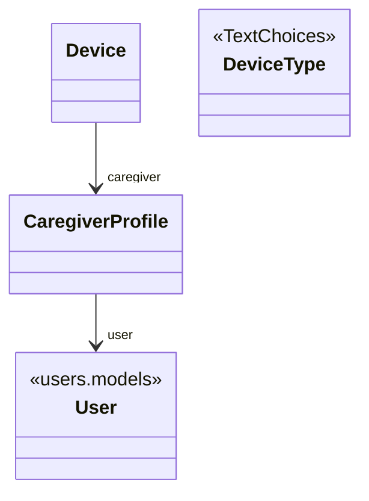

# Caregivers App

The `caregivers` app provides a custom caregiver profile model for the `Caregiver` user type (in the `users` app). It allows us to specify additional fields that a caregiver requires. The design is inspired by *Two Scoops of Django* Section 22.3.3.

The design is as follows (see the [code reference][opal.caregivers.models] for implementation details of each class):

