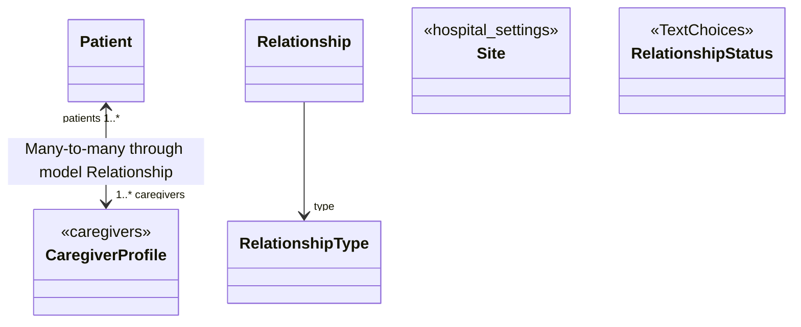

<!--
SPDX-FileCopyrightText: Copyright (C) 2022 Opal Health Informatics Group at the Research Institute of the McGill University Health Centre <john.kildea@mcgill.ca>

SPDX-License-Identifier: AGPL-3.0-or-later
-->

# Patients

The `patients` app provides the central piece, the `Patient`, as well as the relationship types and relationships between a Patient and caregiver.

The design is as follows (see the [code reference][opal.patients.models] for implementation details of each class):

