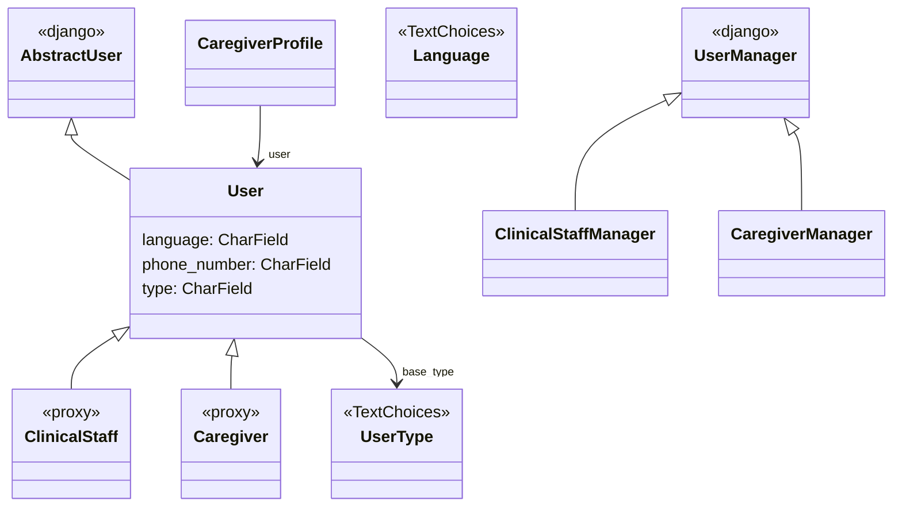

# Users App

The `users` app provides a custom user model for Django. Besides specifying additional fields it also adds a user type. This allows us to differentiate between different kinds of users. The design follows *Two Scoops of Django* Chapter 22 (specifically section 22.3).

The design is as follows (see the [code reference][opal.users.models] for implementation details of each class):

